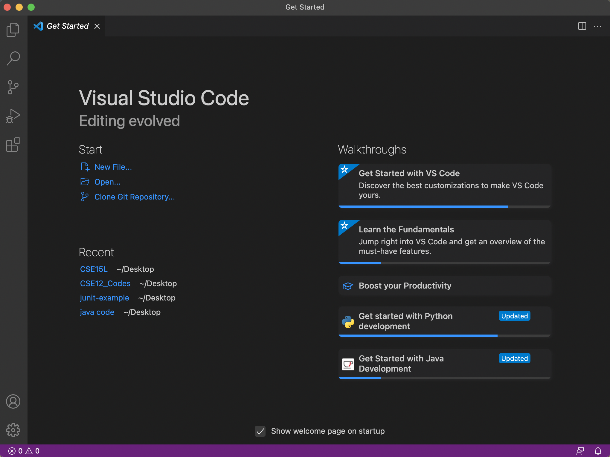
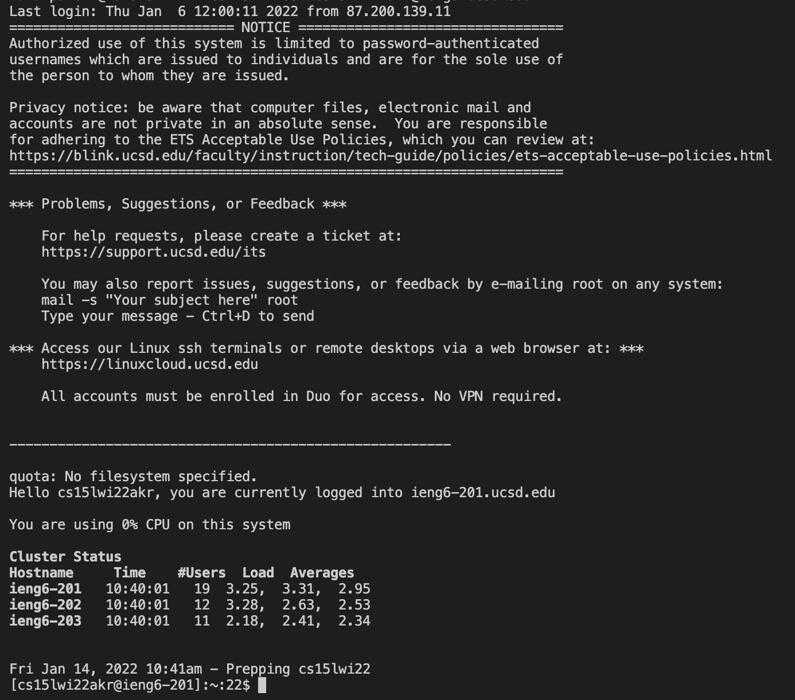
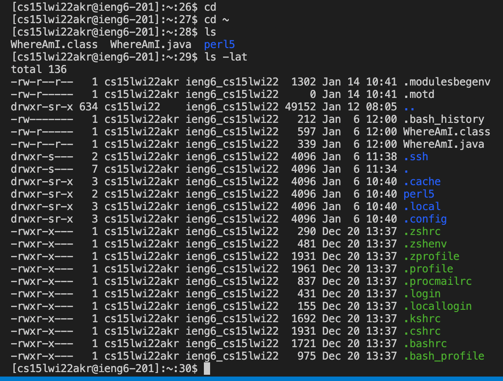
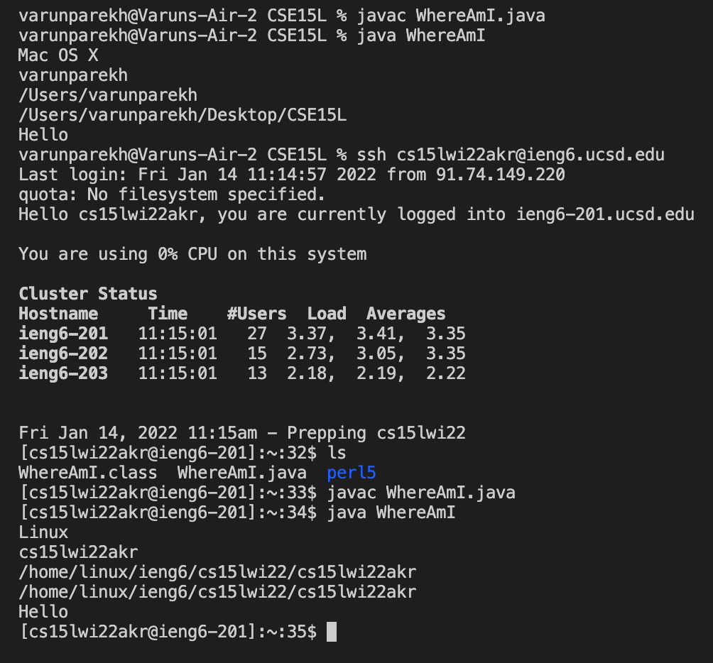
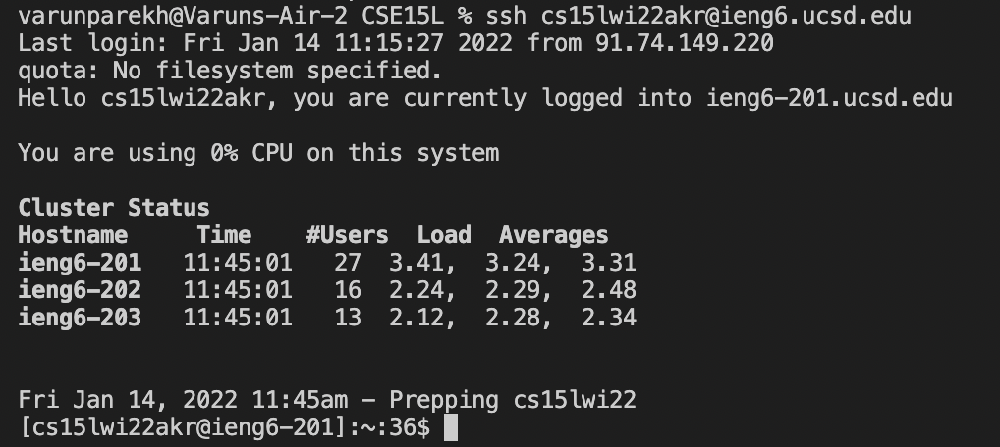
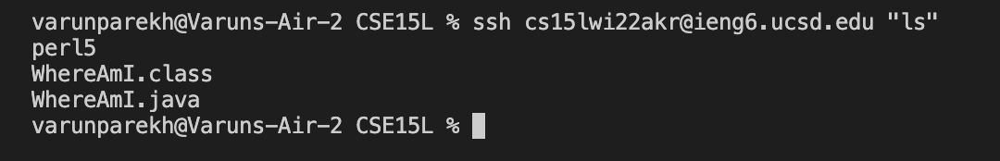

# Remote Access

## What are the steps needed to connect to a remote server optimally?


## **Step 1: Installing VSCode**

You need an editor or IDE (Integrated Development Environment) in order to create and run programs as well as connect to a remote server. In my personal opinion, the best one is VSCode. Here is what you need to do to install it.

Go to [Download VSCode](https://code.visualstudio.com/) and download VSCode for your specific operating system. It covers all three major OS's For Chromebook and tablets, you will need to inform your lab leader for additional information.

When done, it should look like this. Mine is on Mac OS and hence might look different on your screen if you're using a different OS.



## **Step 2: Remotely Connecting**

Now that we have an IDE to work, let's do the thing we came here to do: Remote Connecting to a server. This act is done everywhere from different CSE classes to even your future job, thus this is an important skill to learn.

If you're on Windows, bad luck, you need to install OpenSSH which allows you to remote connect to other computers and servers. 
Click to go to the site [OpenSSH Instructions](https://docs.microsoft.com/en-us/windows-server/administration/openssh/openssh_install_firstuse)

Aditionally you will need to find your course specific account using this site: [Course Login Details](https://sdacs.ucsd.edu/~icc/index.php)
If this is your first time using the UCSD server, you will need to change/create your password. How to do that is through above link.

Once you are ready, open up VSCode and access the terminal.

Now that we are ready to go, here are the pieces of code you will need to write to connect to the server.

1. ```ssh cs15lwi22akr@ieng6.ucsd.edu``` (replace the ```akr``` with the three letters you find in your own login details, refer above for more details)
2. If it's your first time accessing the server, you will get a message. There is no need to worry, just enter yes. 
```
The authenticity of host 'ieng6.ucsd.edu (128.54.70.227)' can't be established.
RSA key fingerprint is SHA256:ksruYwhnYH+sySHnHAtLUHngrPEyZTDl/1x99wUQcec.
Are you sure you want to continue connecting (yes/no/[fingerprint])? 
```
3. After you enter yes and your password, this message will pop up and you would have successfully connected to the remote server.



## **Step 3: Trying some Commands**

Now that we have connected to the server, let's try out some simple commands. 
There are hundreds of commands we could try but for now, we are going to use four of them 

1. ```ls``` - Informs you of the files in your directory.

2. ```ls -lat``` - Gives you a detailed description of the files in your directory including dates, types, names etc.

3. ```cd``` - changes directory to your home directory. You wouldn't see anything change and that is because you're already in your home directory.

4. ```cd ~``` - reverts back to the general directory, again no change is seen because you're in your general directory. Is more applicable in later stages of the course.

Here is what this commands should look like when executed.



Type ```exit``` to exit the server and return back to your laptop.

## **Step 4: Moving files with ```scp```**

Now that we can connect to a remote server, let's run some programs on it.

In order to do that we need to transfer the files we are working locally to the server and then run the code. We do this using the ```scp``` command.

1. Create a program called ```WhereAmI.java``` and put this code in it.

```
class WhereAmI {
  public static void main(String[] args) {
    System.out.println(System.getProperty("os.name"));
    System.out.println(System.getProperty("user.name"));
    System.out.println(System.getProperty("user.home"));
    System.out.println(System.getProperty("user.dir"));
    System.out.println("Hello");
  }
}
```
2. Run the ```javac``` and ```java``` commands to get a sense of what the output is on your computer.
3. Run this command ```scp WhereAmI.java cs15lwi22zz@ieng6.ucsd.edu:~/``` (obviously using your login details)
4. Enter your password and your file should be transferred then. After that, use the ```ssh``` command and access the server.
5. Enter the ```ls``` command and you should see your file ```WhereAmI.java``` present. Run the ```javac``` and ```java``` commands and see the difference in output.
6. This is what the terminal should look like.



## **Step 5: Using SSH keys**

Haven't you noticed how long it takes to keep entering the password every time we need to access the server or copy a program into the server or do any small change. Don't you not want to keep typing your password? The solution to that is using SSH keys. It creates this sort of portal that connects your laptop to the server that is public to the server but private on your laptop so that no one can access it but you. It removes the hassle of repeatdedly entering your password and makes your workflow much easier.

Here's what you should run to set it up.

```
$ ssh-keygen
```

Any option comes up, just press enter and let the computer do the work for you.

For your information: There will be two files on your system for both keys; the private key is in a file called id_rsa and the public key is in a file called id_rsa.pub in the .ssh directory on your computer.

If you're on Windows, you have some extra steps to follow [Extra Steps for Windows Users](https://docs.microsoft.com/en-us/windows-server/administration/openssh/openssh_keymanagement#user-key-generation)

After this, you will need to enter the server and enter this

```
$ ssh cs15lwi22zz@ieng6.ucsd.edu
<Enter password>
$ mkdir .ssh
```
Exit the server and then type this. Change it to match your username and password.

```
$ scp /Users/joe/.ssh/id_rsa.pub cs15lwi22@ieng6.ucsd.edu:~/.ssh/authorized_keys
```
Now you're done. This is how doing the ```ssh``` command looks like now.




## **Step 6: Optimizing Remote Running**

Here are some tips and tricks you can use to optimize your remote running.

1. Add quotes at the end of your ```ssh``` statement in order to write a statement that will run on the server.

Ex. ```ssh cs15lwi22akr@ieng6.ucsd.edu "ls"```

**With this you will save a keystroke as well as waiting for the system to boot up first and then typing the command.**

On the terminal



2. Use semicolons to write multiple commands on one line just like in any other programming language.

Ex. ```scp WhereAmI.java OtherMain.java; javac OtherMain.java; java WhereAmI```

**With this you will save two keystrokes as well as waiting for the system to boot up first and then typing the command.**

3. Use the up arrow key to use the last command executed to speeden your testing processes.

**With this, you save countless of keystrokes and time as you no longer have to type any previous command or any command you have already executed as you could find it using the upward arrow key to find it and then execute it.**

5. Use this one line as an example or a template for further use to transfer and run your program on the server in one line 

```scp varunparekh@Varuns-Air-2 CSE15L % /WhereAmI.java cs15lwi22akr@ieng6.ucsd.edu:~/; ssh cs15lwi22akr@ieng6.ucsd.edu "javac WhereAmI.java; java WhereAmI"```

**With this command you save four keystrokes as well as having a very succint and satisfying execution of your code. It would copy the code, access the server as well compile and run the code all in a single line. You no longer have to wait for the laptop to access the server or to copy the code to the server and then type the commands to execute. It just makes everthing easier.**

## **That is it. This is all you need to know to be able to connect to a remote server optimally. Use it wisely.**
