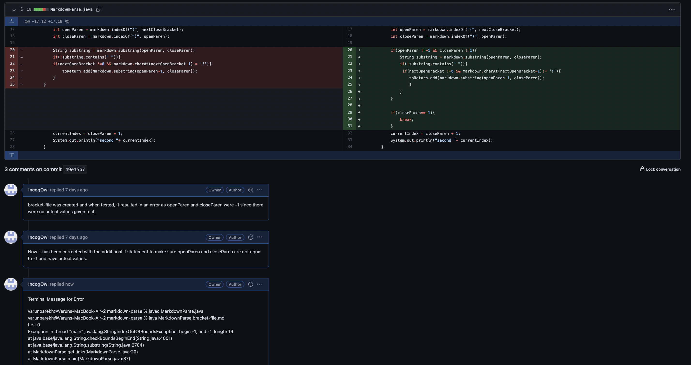

# Failure Inducing Input, Bugs and Symptoms

## How to identify bugs and symptoms using specifc inputs

Today we will be using three examples wherein a failure inducing output was given. We will be identifying the bugs and symptoms that were present in the code and the relationship between them.
We will be using the ```MarkdownParse.java``` present in the repository as our base file for displaying these examples.

## **Code Example No.1**

In our first example, we assumed that the input would be correct and would be links only. 
This failure inducing input has a picture as well. Our current code's output would have included it in the list of links as well since it only checks if the parenthesis and brackets are present and adds the element in between the parenthesis.
The symptom here is the picture name being included as a link in the final output, the bug is the add statement that takes in any element that has brackets and is in between the parenthesis. This is fixed by adding an extra if statement that checks if there isn't an exclamation point and if the next open bracket is not at zeroeth index.
If this is true then it adds the link to the list.

Here is the link to the test file that caused the symptom: [Fail-input File No.1](new-file.md)

Here is the change in the code to correct the symptom as shown in the commit history


## **Code Example No.2**

In the second example, we assumed that even if the input was in the link format, it would be an actual link and not random text.
This failure inducing input has the necessary brackets and parenthesis but with an invalid link as we have put "this is a random text" instead of an actual link.
The current code would have included it in the list as well since it's not a picture or doesn't have an exclamation point or the next open bracket is not at zeroeth index as well as being written in the correct format. The symptom here is the phrase "this is a random text" is included in the list in the final output. The bug is the add statement that takes in any element that is not a picture and written in the right format. It doesn't check if the link is actually a link. We fix this bug by checking if there is any spaces in the link. If there is not, it passes and is added to the list otherwise it fails and is not added.

Here is the link to the test file that caused the symptom: [Fail-input File No.2](empty-file.md)

Here is the change in the code to correct the symptom as shown in the commit history.


## **Code Example No.3**

In the final exampke, we assumed that the input would have both the parenthesis and brackets. This failure inducing input has the correct link format and it's not a picture. What is missing is that it does not have any parenthesis. When executed, the program results in an error as the openParen and closeParen are -1 and thus not valid index thus a StringIndexOutOfBoundsException is called. The symptom here is the Exception that is called. The bug is the if statements with the add statement because it did not include the condition of whether the input was typed wrong with brackets instead of parenthesis. This is fixed by having an if conditon that checks if openParen and closeParen are equal to -1, meaning that the link was not in the typical format, and a break statement when closeParen is equal to -1 to end the program. A better solution still needs to be written but this is what we have created as a solution so far.

Here is the link to the test file that caused the symptom: [Fail-input File No.3](bracket-file.md)

Here is the change in the code to correct the symptom as shown in the commit history. 




