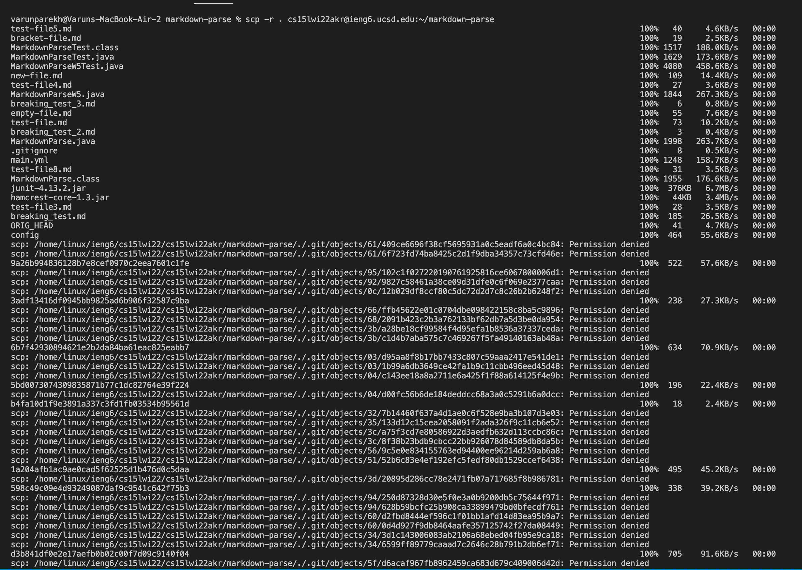
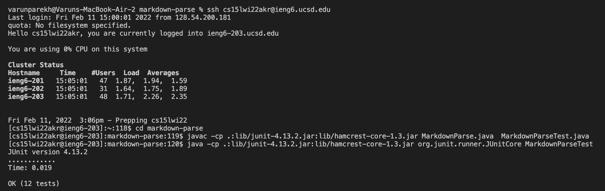
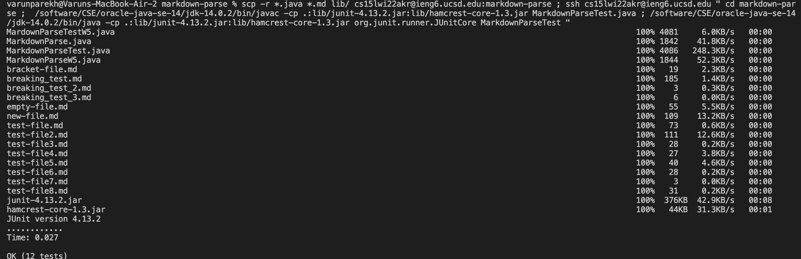

# How to copy whole directories into the server using ``` scp -r ```


As of right now, we have been using ```scp``` to copy one file at a time from our private directory into the remote server. 
In the future, as we work on larger projects, it will become a tedious proccess to keep copying single files one at a time. We will also be working in directories
and sub directories and figuring out how to enter those files to then use ```scp``` to copy them will become tiring, fustrating and can lead to many mistakes. 

To solve this problem, we can recursively go through our personal directory to copy and transfer files from our directory to the remote server. For example, let's
say that we want to copy the ```markdown-parse``` directory into the remote server.

We type in this command ```scp -r . cs15lwi22@ieng6.ucsd.edu:~/markdown-parse``` (Adjust the line with the correct login details)

```-r``` means using recursion

```.``` means the current personal directory

The rest allows for the computer to access the remote server and then copy the ```markdown-parse``` directory into the remote server. Even if we do not have a 
```markdown-parse``` directory in the remote server, it will create it for us and then copy and place the files into the directory.

This is what the terminal should look like after doing the command.




This is just a small snippet of the terminal after this command is typed.


Now that we have copied the entire repository into the server, let's run ```MarkdownParseTest.java``` to see if all the tests work and to prove that the directory 
has been copied and is working exactly as we want it to.



Now that the code runs exactly as we want it to, let's combine everything we have done so far and write one line that is able to copy the whole  ```markdown-parse``` 
directory into the remote server and run the tests within it. I made a small change in the ```scp``` statement to allow for only ```.java``` and ```.md``` files to be copied into the remote server to save some time.

``` scp -r *.java *.md lib/ cs15lwi22akr@ieng6.ucsd.edu:markdown-parse ; ssh cs15lwi22akr@ieng6.ucsd.edu " cd markdown-parse ;  /software/CSE/oracle-java-se-14/jdk-14.0.2/bin/javac -cp .:lib/junit-4.13.2.jar:lib/hamcrest-core-1.3.jar MarkdownParseTest.java ; /software/CSE/oracle-java-se-14/jdk-14.0.2/bin/java -cp .:lib/junit-4.13.2.jar:lib/hamcrest-core-1.3.jar org.junit.runner.JUnitCore MarkdownParseTest " ```

Using it, the terminal should look like this:


