# Code Review using three example

**The repositories we will be using to conduct this code review**

[My Repository](https://github.com/IncogOwl/markdown-parse.git)

[Comparator Repository](https://github.com/yi113/markdown-parse.git)

## Snippet 1

```
`[a link`](url.com)

[another link](`google.com)`

[`cod[e`](google.com)

[`code]`](ucsd.edu)
```

As a website, this should produce 

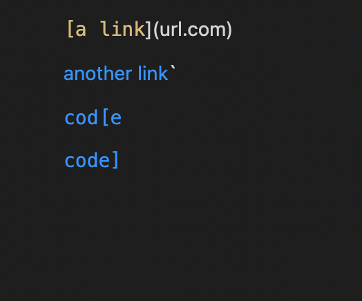

These are the changes I made to MarkdownParseTest.java so that we can test Snippet 1.

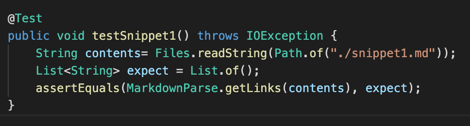

I ran the tests on both versions of MarkdownParse and these were my outputs

**My output**:

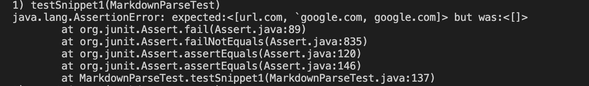

**Their output:** 

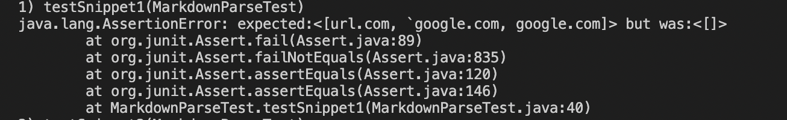


**What can I do to fix my code?**

This problem can be solved in less than 10 lines of code. We can fix it by including an if condition that checks if there is a backtick in the parenthesis or brackets of the link or right after or before the link or if there are backticks present before the next brackets. It does not take amything present there as a link since it is within a code block and is not an indicidual link.


## Snippet 2

```
[a [nested link](a.com)](b.com)

[a nested parenthesized url](a.com(()))

[some escaped \[ brackets \]](example.com)
```

As a website, this should produce 

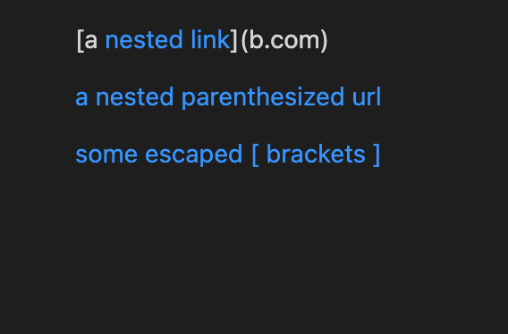

These are the changes I made to MarkdownParseTest.java so that we can test Snippet 2.

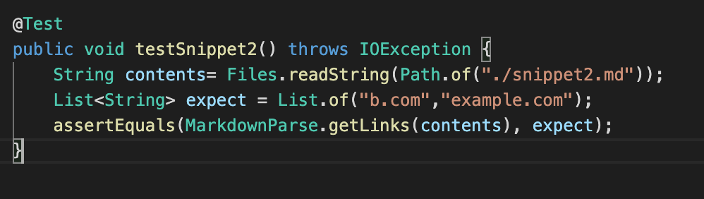

I ran the tests on both versions of MarkdownParse and these were my outputs

**My output:**

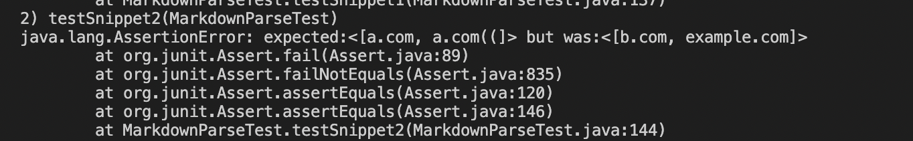

**Their output:** 

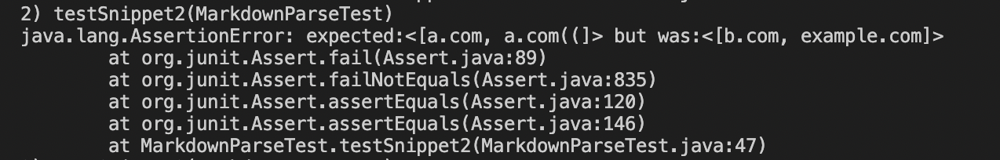

**What can I do to fix my code?**

We can fix this problem in less than 10 lines of code. We must put an if condition to check if there are any brackets wihin the first brackets and if found, to continue the loop or to avoid it completely till it finds a close bracket. We can use the indexOf() function to find any type of brackets within the link and adjust accordinly. We must also put another if condition that checks if there is a parenthesis or bracket in the actual link (line within parenthesis) and if it's true, it must discard the link and not include it at all.


## Snippet 3

```
[this title text is really long and takes up more than 
one line

and has some line breaks](
    https://www.twitter.com
)

[this title text is really long and takes up more than 
one line](
    https://ucsd-cse15l-w22.github.io/
)


[this link doesn't have a closing parenthesis](github.com

And there's still some more text after that.

[this link doesn't have a closing parenthesis for a while](https://cse.ucsd.edu/


)

And then there's more text
```

As a website, this should produce 

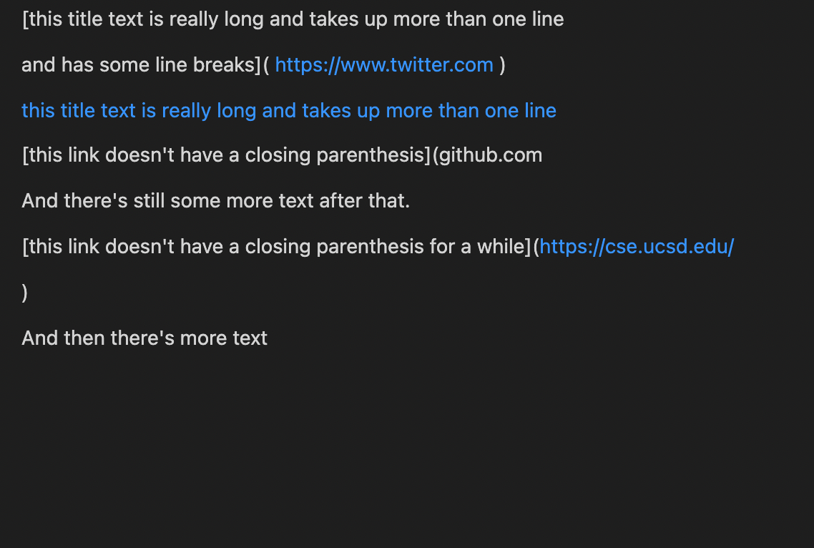

These are the changes I made to MarkdownParseTest.java so that we can test Snippet 3.

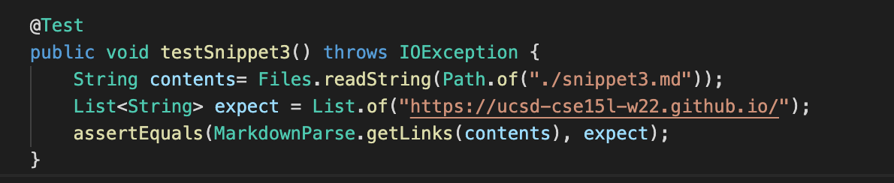

I ran the tests on both versions of MarkdownParse and these were my outputs

**My output:**

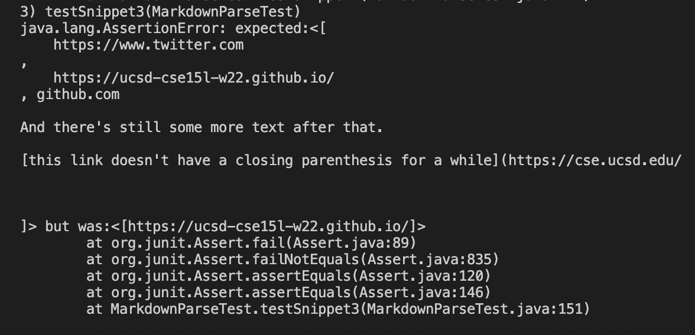

**Their output:** 

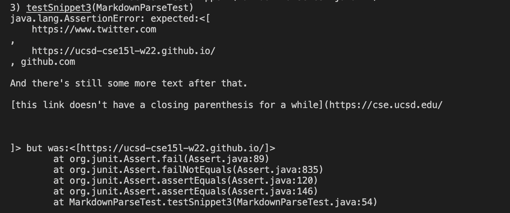

**What can I do to fix my code?**

We can solve this problem in less than 10 lines of code. We will need an if condition that checks if there is any ```"\n"``` present in the string using indexOf(). If there is, then we can disregard the link completely since it is not in the correct markdown language format otherwise it will be included since markdown still considers it as one line.
