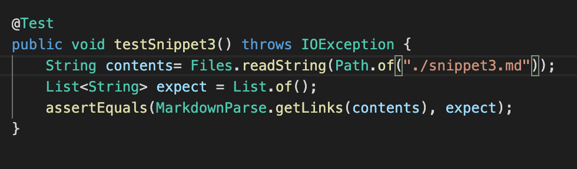
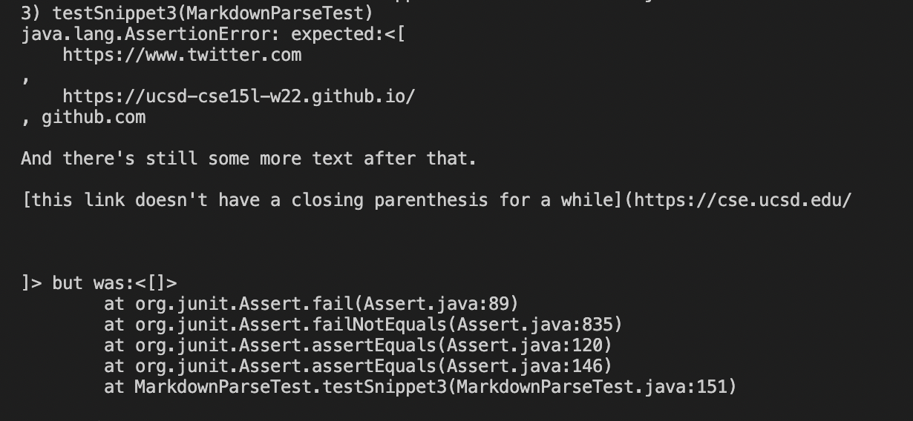
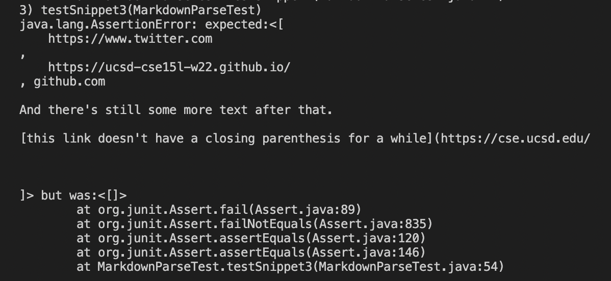

# Code Review using three example

**The repositories we will be using to conduct this code review**

[My Repository](https://github.com/IncogOwl/markdown-parse.git)

[Comparator Repository](https://github.com/yi113/markdown-parse.git)

### Snippet 1

```
`[a link`](url.com)

[another link](`google.com)`

[`cod[e`](google.com)

[`code]`](ucsd.edu)
```

As a website, this should produce 


These are the changes I made to MarkdownParseTest.java so that we can test Snippet 1.


I ran the tests on both versions of MarkdownParse and these were my outputs

My output:


Their output: 


If fail, what to do:...........


### Snippet 2

```
[a [nested link](a.com)](b.com)

[a nested parenthesized url](a.com(()))

[some escaped \[ brackets \]](example.com)
```

As a website, this should produce 


These are the changes I made to MarkdownParseTest.java so that we can test Snippet 2.


I ran the tests on both versions of MarkdownParse and these were my outputs

My output:


Their output: 


If fail, what to do:...........


### Snippet 3

```
[this title text is really long and takes up more than 
one line

and has some line breaks](
    https://www.twitter.com
)

[this title text is really long and takes up more than 
one line](
    https://ucsd-cse15l-w22.github.io/
)


[this link doesn't have a closing parenthesis](github.com

And there's still some more text after that.

[this link doesn't have a closing parenthesis for a while](https://cse.ucsd.edu/


)

And then there's more text
```

As a website, this should produce 


These are the changes I made to MarkdownParseTest.java so that we can test Snippet 3.



I ran the tests on both versions of MarkdownParse and these were my outputs

My output:



Their output: 



If fail, what to do:...........
