# Comparison between the repositories 

## In this report, I will be comparing my repository and the one provided by the staff and seeing the differences in the response of each of our MarkdownParse programs to the 652 tests provided in the test-files folder

**I was able to find two tests that led to different outputs in the two repositories, but how did I find it?**

I first cloned the updated markdown-parse repository for the website to my ```ieng6``` account and stored it in the directory called ```week9-markdown-parse```
because my repository is called ```markdownparse``` and I did not want to have any confusion between the two. 

I entered the following commands to copy the ```script.sh``` and ```test-files``` folder to my own markdown-parse directory.

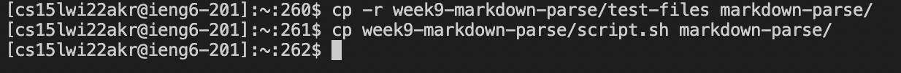

I then entered the following commands in my own directory to run ```script.sh``` and store the output it in a file called ```results.txt```

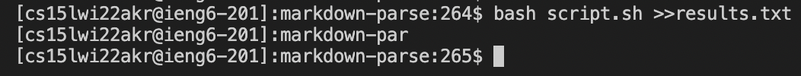

I exited out of my directory to the home directory of my ```ieng6``` account and then entered the ```week9-markdown-parse``` and ran```script.sh``` 
and store the output it in a file called ```results.txt```.

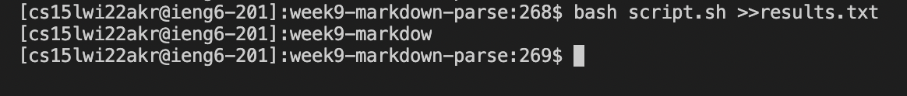


I then entered the command ```diff markdown-parse/results.txt week9-markdown-parse/results.txt ``` to find the differences. 

I then used the ```awk``` command to look through the lines and identify the tests that caused the differences and to see what were the bugs in each of them.
Using this, I identified two tests that were causing errors. 

They were files 194.md and 484.md.

We will now be looking at both tests and seeing which implementation was correct and how can we fix the incorrect one.


## File 194.md

The text in the file looks like this 

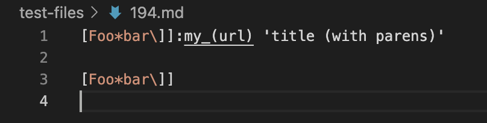

As per ```diff```, these were the differences 

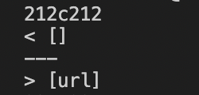

My implementation was correct as the ```MarkdownParse``` file should have yielded an empty ArrayList as we see here.

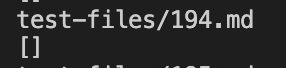

To fix the other implementation, we must add a condition to check if there is anything between the end bracket and the open parenthesis. 
There should also be an if statement to check whether there are two brackets back to back. If that's the case then it should be invalid 
link as done in my implementation. These were the two problems in the ```MarkdownParse``` file given by the staff that caused this error.

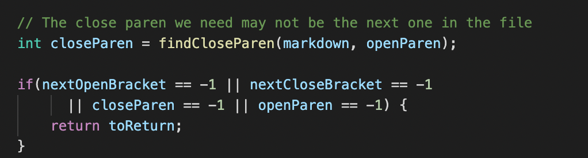


## File 489.md

The text in the file looks like this

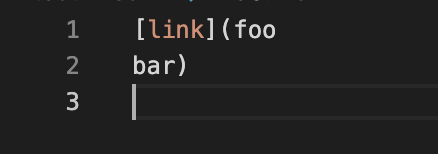

As per ```diff```, these were the differences 

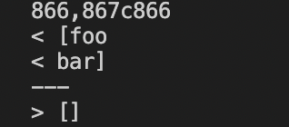

The staff's implementation was correct as the ```MarkdownParse``` file should have yielded an empty ArrayList as we see here.

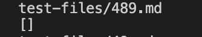

To fix my implementation, I must add a condition that checks if there are any spaces or new lines in the link and if that is the case, 
to avoid it and move on to the next link.

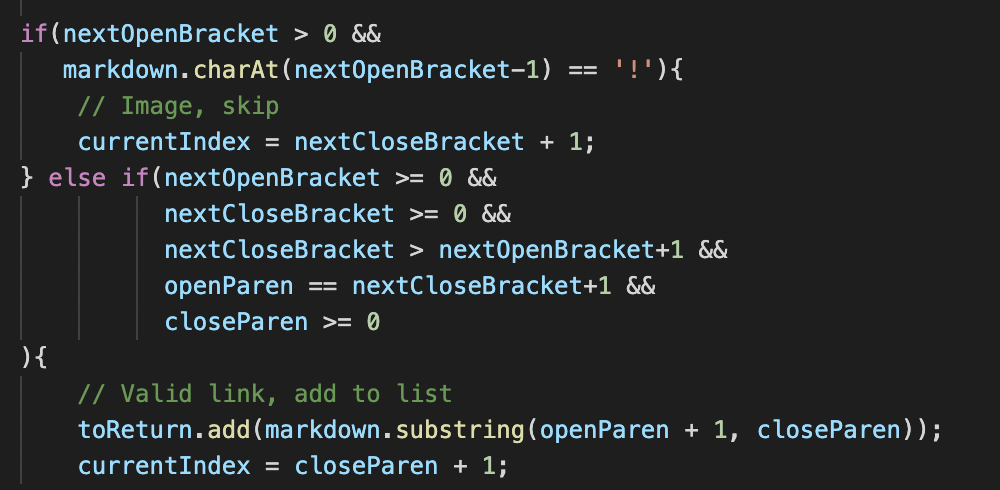


**That is all for both the tests, with the corrections I have mentionned above, it should be enough to fix the errors and have it running well.**
